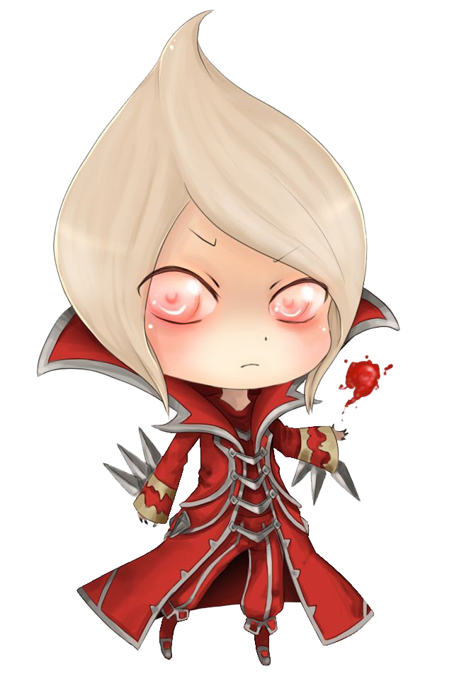

<!-- PROJECT LOGO -->
<br />
<p align="center">
  <a href="#">
    
  </a>

  <h3 align="center">LívidoBOT</h3>

  <p align="center">
    A discord.js bot!
    <br />
    <a href="https://github.com/AnderCoira/LividoBOT"><strong>Explore the docs »</strong></a>
    <br />
    <br />
  </p>
</p>


<!-- TABLE OF CONTENTS -->
<details open="open">
  <summary>Table of Contents</summary>
  <ol>
    <li><a href="#built-with">Built With</a></li>
    <li>
      <a href="#getting-started">Getting Started</a>
      <ul>
        <li><a href="#prerequisites">Prerequisites</a></li>
        <li><a href="#installation">Installation</a></li>
      </ul>
    </li>
    <li><a href="#contact">Contact</a></li>
  </ol>
</details>

### Built With

This project is built with:
* [Node.js](https://nodejs.org/es/)
* [JavaScript](https://developer.mozilla.org/es/docs/Web/JavaScript)
* [Discord.js](https://discord.js.org/#/)discor
* [Canvasjs](https://www.npmjs.com/package/canvasjs)
* [ytdl](https://www.npmjs.com/package/ytdl)


<!-- GETTING STARTED -->
## Getting Started

To get a local copy up and running follow these simple steps.

### Prerequisites

* npm
  ```sh
  npm install npm@latest -g
  ```

### Installation

1. Create your bot at [https://discord.com/developers/applications](https://discord.com/developers/applications)
2. Get your riot games api key at [https://developer.riotgames.com](https://developer.riotgames.com)
3. Clone the repo
   ```sh
   git clone https://github.com/your_username_/Project-Name.git
   ```
4. Install NPM packages
   ```sh
   npm install
   ```
5. Enter your bot key in `main.js`
   ```JS
   bot.login('YOUR KEY');
   ```
6. Enter your riot api key in `riotAPI.js`
   ```JS
   const apiKey = 'YOUR RIOT API';
   ```

<!-- CONTACT -->
## Contact

Ander Coira - [@AnderCoiraDAM](https://twitter.com/AnderCoiraDAM) - damwcoira@gmail.com

Project Link: [https://github.com/AnderCoira/LividoBOT](https://github.com/AnderCoira/LividoBOT)
